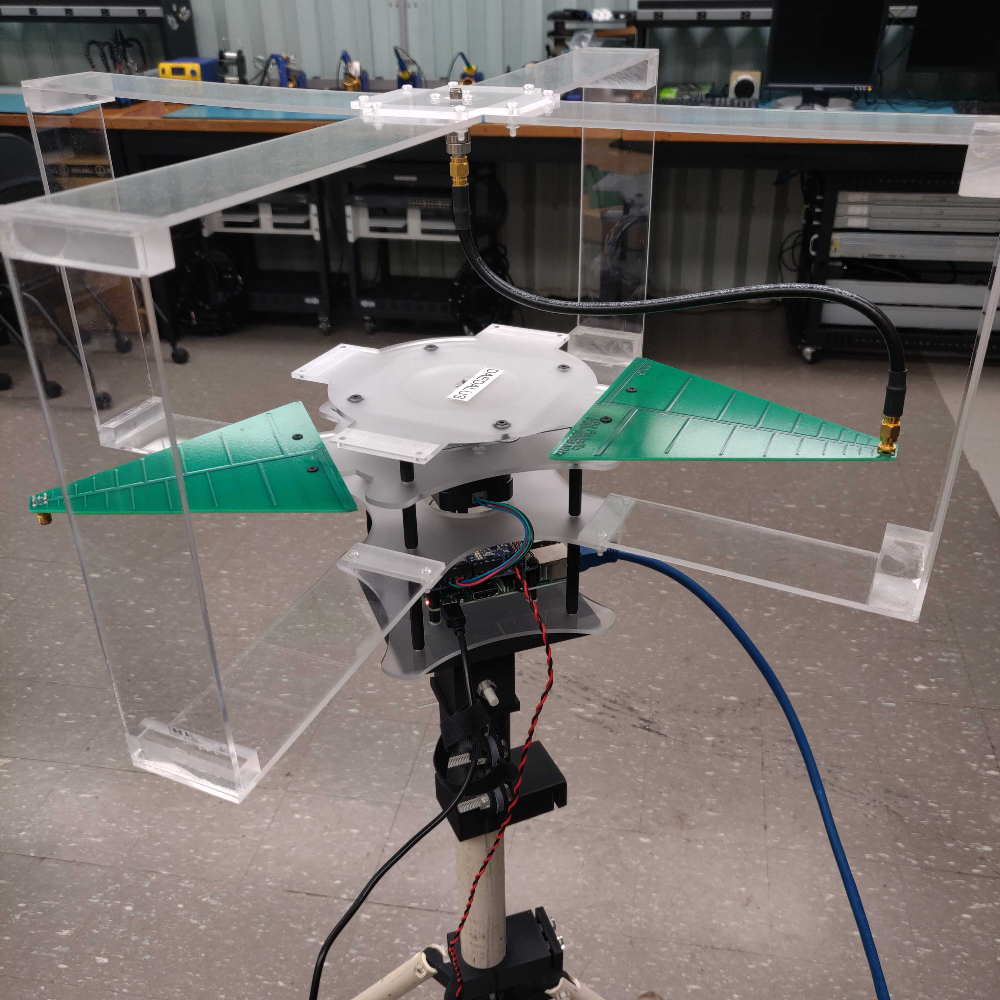
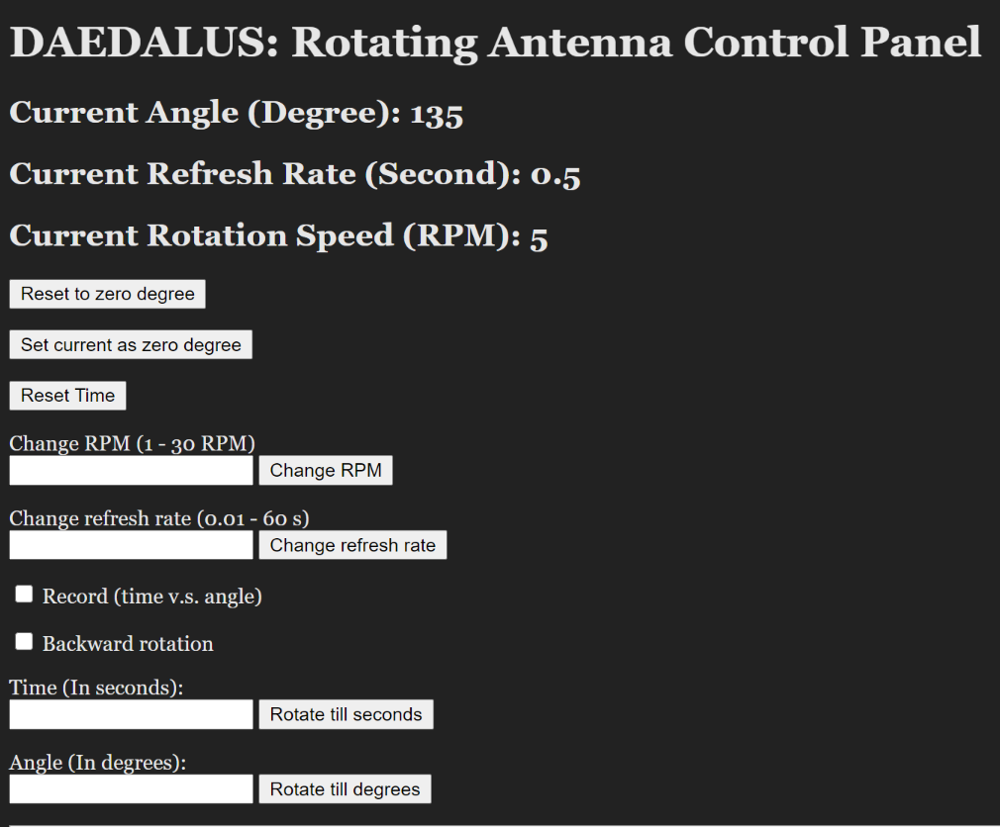

# RF_Rotator
*PLEASE NOTE:* This repository only includes the python code for the Raspberry Pi and the webpage. However, this does not include how to build the frame! It was 3D printed from a colleague, and I do not have the source files for it.

# Functionalities

- Change rotation speed of motor
- Live update of angle reading to webpage
- Change refresh rate of live updates
- Record time v.s. angle measurements into file
- Bi-directional
- Access localhost/angle.json for full reading with timestamp
- Set zero degree mark for encoder
- Reset the rotator back to the zero degree mark

# Materials
- 1 Trinamic QSH4218-35-18-027 stepper motor
- 1 Raspberry Pi 3 w/ Adafruit Stepper MotorHAT
- 1 CUI AMT22 Modular Absolute Encoders 12 bit Single-Turn
- 1 SPI cable, with female headers -> male SPI interface

# Improvements / Problems
- Page remains unresponsive once you start rotating (still updates angle reading), becomes responsive once it stops rotating
  - Possible solution: Run on a child process/parallel thread
- Motor does not move in a smooth motion; jittery as it rotates
  - Possible solution: Up the SPI refresh rate, purchase a different motor
- Rotation Speed (RPM) currently not accurate, modeling of timing between microsteps inconsistent when implemented from a standalone to the server
- When resetting or turning to a specific amount of degrees, the error margin is +/- 2 degrees
