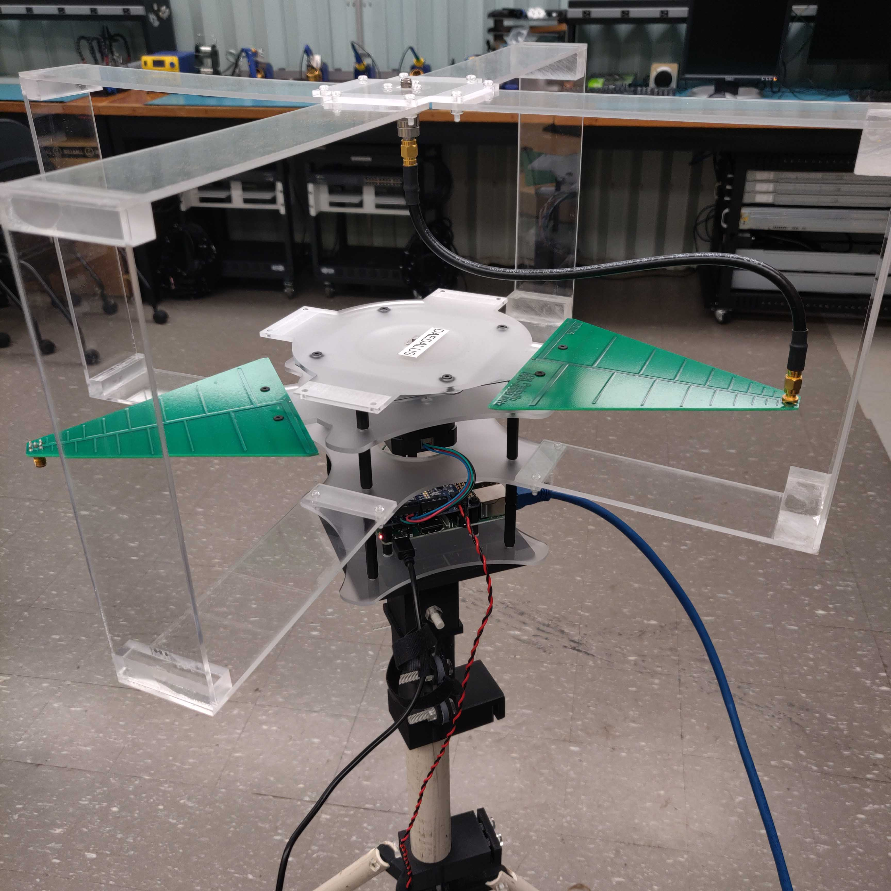
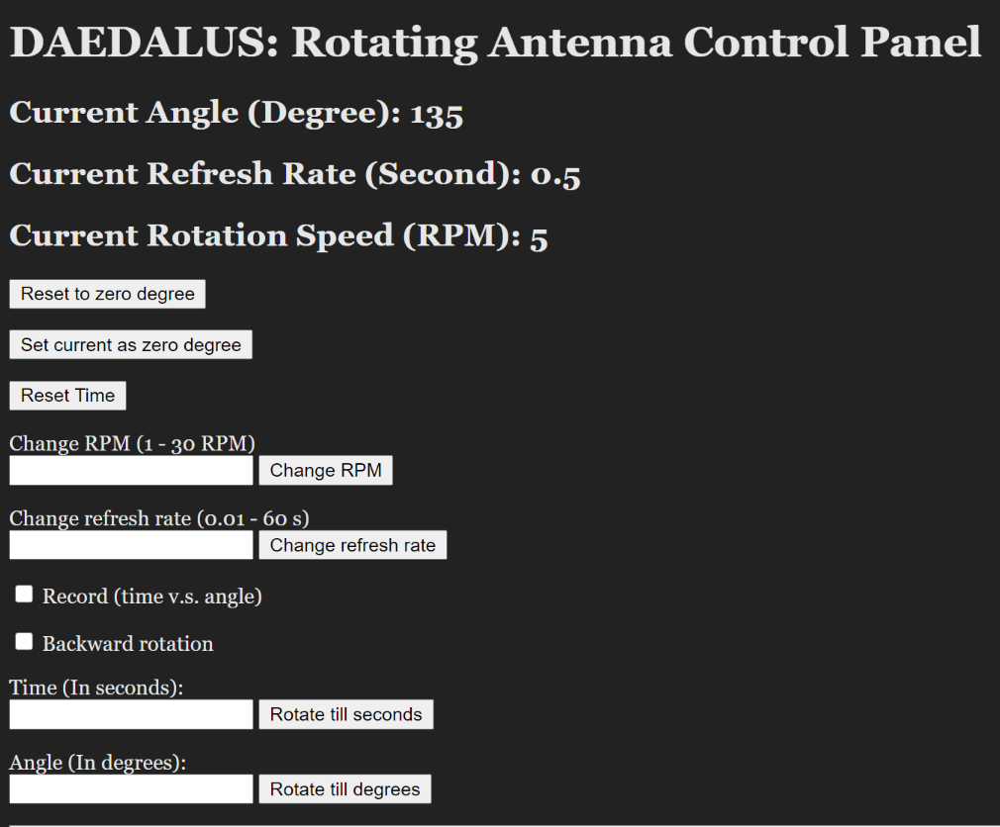

# RF_Rotator
*PLEASE NOTE:* This repository only includes the python code for the Raspberry Pi and the webpage. However, this does not include how to build the frame! It was 3D printed from a colleague, and I do not have the source files for it. (Sorry!)

# Quick Setup (venv)

Run this once on the Raspberry Pi to create a virtual environment and install Python packages:

```bash
chmod +x ./setup_venv.sh
./setup_venv.sh
```

Use a custom venv path if needed:

```bash
./setup_venv.sh ~/rf_rotator_venv
```

Then run the app:

```bash
~/venv/bin/python ./rf_rotator
```

# Troubleshooting: SPI Permission Denied

If the app logs `PermissionError: [Errno 13]` when opening SPI, enable SPI and grant your user SPI access:

```bash
sudo raspi-config nonint do_spi 0
sudo usermod -aG spi $USER
sudo reboot
```

After reboot, verify device nodes exist:

```bash
ls -l /dev/spidev*
```

If your service runs as a custom user, make sure that user is in the `spi` group.

# Troubleshooting: AMT22 Stuck At 0 Degrees

For AMT222A-V, the code now uses the native AMT22 read sequence (0x00, 0x00) with checksum validation.

If angle still stays at 0:

1. Verify AMT22 switch is in RUN mode (not programming mode).
2. Verify wiring for SPI and CS pin for CE1 (device 0,1):
  - Pi SCLK -> encoder SCLK
  - Pi MOSI -> encoder MOSI
  - Pi MISO -> encoder MISO
  - Pi CE1 -> encoder CS
  - Pi GND -> encoder GND
  - Pi 5V -> encoder VCC (as required by your module/cable)
3. Try SPI mode and speed overrides at launch:

```bash
ENCODER_SPI_MODE=0 ENCODER_SPI_HZ=500000 ~/venv/bin/python ./rf_rotator
```

If needed, test alternate modes:

```bash
ENCODER_SPI_MODE=1 ENCODER_SPI_HZ=200000 ~/venv/bin/python ./rf_rotator
ENCODER_SPI_MODE=2 ENCODER_SPI_HZ=200000 ~/venv/bin/python ./rf_rotator
ENCODER_SPI_MODE=3 ENCODER_SPI_HZ=200000 ~/venv/bin/python ./rf_rotator
```

Default encoder CS is CE0 (SPI device 0). If needed, you can override with:

```bash
ENCODER_SPI_BUS=0 ENCODER_SPI_DEVICE=0 ~/venv/bin/python ./rf_rotator
```

You can also tune byte timing and checksum behavior:

```bash
ENCODER_BYTE_DELAY_US=3 ENCODER_REQUIRE_CHECKSUM=0 ~/venv/bin/python ./rf_rotator
```

Live diagnostics endpoint:

```text
http://<pi-ip>:5000/encoder_debug.json
```

Use it to confirm whether raw SPI frames are changing while rotating.

Quick bus/device/mode scan endpoint:

```text
http://<pi-ip>:5000/encoder_scan.json
```

This probes CE0/CE1 and SPI modes 0-3 and reports which combinations show changing raw values or valid checksums.

# Troubleshooting: GPIO Access (/dev/mem)

If motor actions fail with `RuntimeError: No access to /dev/mem`, grant GPIO access to the runtime user:

```bash
sudo usermod -aG gpio $USER
sudo reboot
```

After reboot, confirm group membership:

```bash
id
```

If running as a systemd service, make sure the service user belongs to `gpio` (and `spi` if encoder is used).

# Functionalities


- Change rotation speed of motor
- Live update of angle reading to webpage
- Change refresh rate of live updates
- Record time v.s. angle measurements into file
- Bi-directional
- Access localhost/angle.json for full reading with timestamp
- Set zero degree mark for encoder
- Reset the rotator back to the zero degree mark

# Materials
- 1 Trinamic QSH4218-35-18-027 stepper motor
- 1 Raspberry Pi 3 w/ Waveshare Stepper Motor HAT
- 1 CUI AMT22 Modular Absolute Encoders 12 bit Single-Turn
- 1 SPI cable, with female headers -> male SPI interface

## Waveshare HAT Notes

- The motor control code in `rf_rotator` now uses the DRV8825 GPIO interface used by the Waveshare Stepper Motor HAT.
- Default motor channel is M1 (BCM pins DIR=13, STEP=19, EN=12, MODE=16/17/20).
- Set `WS_MOTOR_CHANNEL=M2` before launching if your motor is connected to M2 (DIR=24, STEP=18, EN=4, MODE=21/22/27).
- `WS_CONTROL_MODE = 'hardward'` means microstep mode comes from DIP switches.
- Keep `MICROSTEPS` in code consistent with the DIP microstep setting so timing and degree calculations remain accurate.
- If the motor still does not move, try these runtime flags:
  - `WS_ENABLE_ACTIVE_HIGH=0` for older active-low enable boards.
  - `WS_INVERT_DIR=1` if direction is reversed.
  - Increase pulse width for reliability: `WS_STEP_PULSE_SEC=0.002`.

Example launch:

```bash
WS_MOTOR_CHANNEL=M1 WS_ENABLE_ACTIVE_HIGH=1 WS_STEP_PULSE_SEC=0.002 ~/venv/bin/python ./rf_rotator
```

RPM note:

- Speed is limited by step pulse timing (`WS_STEP_PULSE_SEC`).
- If RPM changes do not appear to take effect at higher values, lower pulse width (for example `WS_STEP_PULSE_SEC=0.0001`).

Degree rotation tuning:

- `DEGREE_TOLERANCE_DEG` controls how close rotate-by-degrees should get before stopping (default `0.25`).
- Lower values increase precision but may take longer and may hunt near the target.

```bash
DEGREE_TOLERANCE_DEG=0.5 ~/venv/bin/python ./rf_rotator
```

Angle display uses one decimal place in both the web UI and `/angle.json`.

# Improvements / Problems
- Page remains unresponsive once you start rotating (still updates angle reading), becomes responsive once it stops rotating
  - Possible solution: Run on a child process/parallel thread
- Motor does not move in a smooth motion; jittery as it rotates
  - Possible solution: Up the SPI refresh rate, purchase a different motor
- Rotation Speed (RPM) currently not accurate, modeling of timing between microsteps inconsistent when implemented from a standalone to the server
- When resetting or turning to a specific amount of degrees, the error margin is +/- 2 degrees
- Bad convention for dealing with web forms (how user data is inputted): Using a chained if/else to determine which button was pressed
